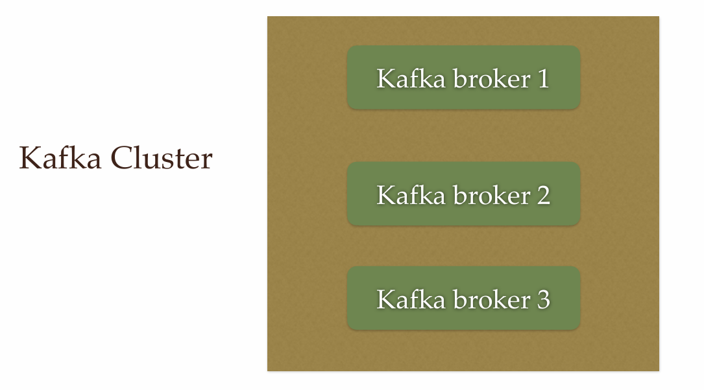
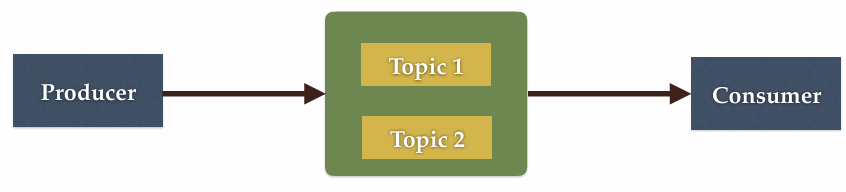
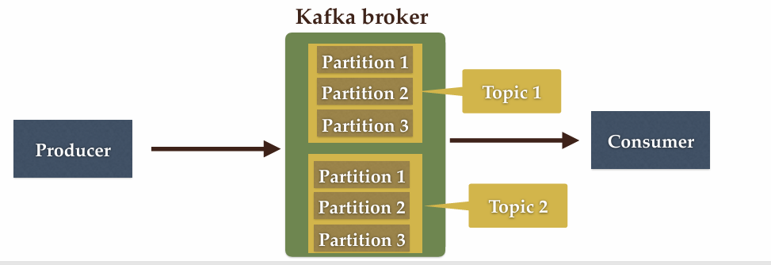
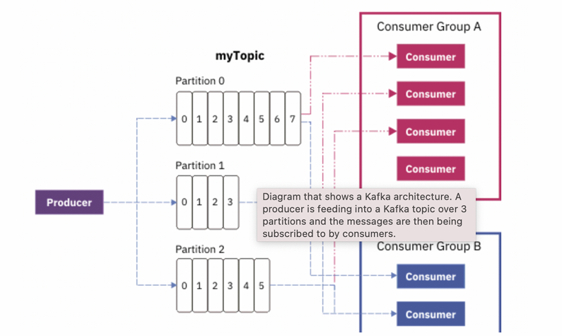

# SpringBoot - Kafka 
Simple project to note some helpful knowledge about Kafka

## I. Apache Kafka Core Concepts
1. Kafka Cluster:
- As we know, Kafka is a distributed system and it acts like a cluster.
- A Kafka cluster consists of a set of brokers. A broker has minimum of 3 brokers. 

    

2. Broker: 
- The broker is the Kafka server. It just a meaningful name that we give to Kafka server. This name make senses because all of things that Kafka does is act a message broker between consumer and producer.
- Producer doesn't send message directly to consumer. It sends the message to broker. Then consummer requests the message from the broker to process.

    

3. Producer
- Producer is the application that sends message to recipient.
- It doesn't send message directly to recipient. Besides that, it send message to broker.

    
    
4. Consumer
- Consumer is the application that reads message from the Kafka server.
- We know that, when the producer sending message, it doesn't send directly to recipient, it will definitely send to broker. And any applications that request data from broker to read are also call consumers.
- Let's image that when we wanna read the content of letter which our friend send from far away, we choose to come forward to post office and take the letter. In this case, our friend is producer, post office is Kafka broker (Kafka server) and we are consumer.

    

5. Kafka Topic
- We learned that the producer sends data to the broker. And the consumer can ask for the broker to read data. And the question is - Which is the data?. We need to some identification mechanism to request data from broker. This lead to notion of Kafka topic. So what is the Kafka topic?
- Topic just simple is a table in database or a folder in file system.
- Topic is identified by a name.
- We can have any number of topics.

    

6. Kafka Partitions
- Kafka topics are devided into number of partitions, which contain records in an unchangeable sequence.
- Kafka will store messages for a topic. But the capacity of data can be enormous and it may 
not be possible to store in a single computer.
- Therefore it will partitioned into multiple parts and 
distributed among multiple computers, since Kafka is a distributed system.

    

7.  Consumer Groups
- A consumer group contains one or more consumers working together to process messages.

    
